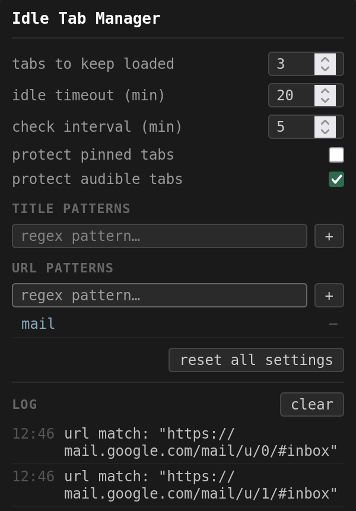
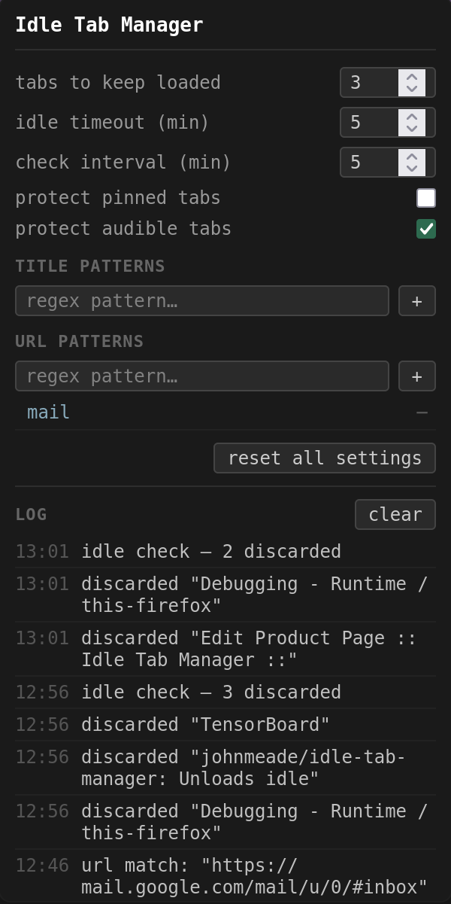

# Idle Tab Manager

    
    

https://addons.mozilla.org/en-US/firefox/addon/idle-tab-manager/

Highly configurable extension for automatically unloading / discarding tabs, to increase your battery life and reduce CPU / memory load.

By default, the 3 most recently viewed tabs will **not** be discarded, and tabs that have not been viewed for more than 20 minutes **will** be discarded. The only exception enabled by default is for tabs playing audio.

Configurable options:
* Set the check interval (minutes), tab idle timeout (minutes), and the number of recent tabs to keep alive.
* Add regex patterns for tab titles and / or URLs to exclude from auto-discarding.
* Toggles for whether audible / pinned tabs should be excluded from auto-discarding.

Supports Firefox, Zen Browser, and probably other forks as well.
